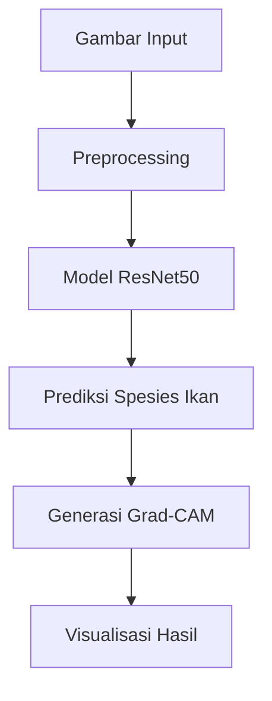

# Klasifikasi Multi-Kelas Ikan Menggunakan Transfer Learning dengan ResNet50 dan Optimasi Adam: Analisis Performa dan Interpretabilitas Model melalui Grad-CAM


Implementasi aplikasi web dari penelitian: "Klasifikasi Multi-Kelas Ikan Menggunakan Transfer Learning dengan ResNet50 dan Optimasi Adam: Analisis Performa dan Interpretabilitas Model melalui Grad-CAM". Aplikasi ini mengklasifikasikan 9 spesies ikan dengan visualisasi interpretasi model menggunakan Grad-CAM.Aplikasi web berbasis deep learning yang mengklasifikasikan spesies ikan dengan visualisasi AI yang dapat diinterpretasikan. Dibangun menggunakan Streamlit dan TensorFlow.

## Fitur

- 🧠 **Transfer Learning dengan ResNet50**: Model CNN canggih yang telah dilatih sebelumnya pada ImageNet
- ⚙️ **Optimasi Adam**: Teknik optimasi canggih untuk pelatihan model
- 🔍 **Interpretabilitas Model dengan Grad-CAM**: Visualisasi area penting dalam gambar yang memengaruhi keputusan model
- 📈 **Analisis Performa**: Evaluasi menyeluruh akurasi dan kinerja model
- 🐟 **Klasifikasi 9 Jenis Ikan**: Mengidentifikasi Black Sea Sprat, Gilt-Head Bream, Horse Mackerel, Red Mullet, Red Sea Bream, Sea Bass, Shrimp, Striped Red Mullet, dan Trout
- 📊 **3 Prediksi Teratas**: Menampilkan 3 hasil prediksi terbaik dengan tingkat keyakinan
- 🔍 **Visualisasi AI**: Menggunakan Grad-CAM untuk menyoroti area yang memengaruhi prediksi
- 🚀 **Antarmuka Ramah Pengguna**: Unggah gambar sederhana dengan drag-and-drop
- ☁️ **Loading Model dari Cloud**: Mengunduh model dari Google Drive saat pertama kali dijalankan

## Cara Kerja

Aplikasi ini menggunakan model deep learning ResNet50 yang telah disesuaikan untuk klasifikasi gambar. Komponen teknis utama:

1. **Pemrosesan Gambar**: 
   - Mengubah ukuran dan memproses gambar untuk ResNet50
   - Mendukung berbagai format gambar (JPG, PNG, JPEG)
   
2. **Inferensi Model**:
   - Mengunduh model yang telah dilatih dari Google Drive
   - Melakukan prediksi menggunakan TensorFlow/Keras
   
3. **AI yang Dapat Dijelaskan**:
   - Menghasilkan peta panas Grad-CAM untuk memvisualisasikan area penting
   - Beralih ke peta saliensi jika Grad-CAM gagal
   - Menunjukkan bagian gambar mana yang memengaruhi prediksi


## Prototype Model

[](https://colab.research.google.com/drive/1QM7UcGnMTVDAS0npJxhLk4LwIj97I53T?usp=sharing)

## Demo Langsung

[](https://your-app-url.streamlit.app/)

## Instalasi

Untuk menjalankan secara lokal:

1. Clone repositori:
```bash
https://github.com/AliArrayyan/resnet50-adam-fish-classification.git
cd resnet50-adam-fish-classification
```
2. Buat dan aktifkan virtual environment:
```bash
python -m venv venv
source venv/bin/activate  # Linux/Mac
venv\Scripts\activate    # Windows
```
3. Instal dependensi:
```bash
pip install -r requirements.txt
```
4. Jalankan aplikasi:
```bash
streamlit run fish_classifier.py
```
